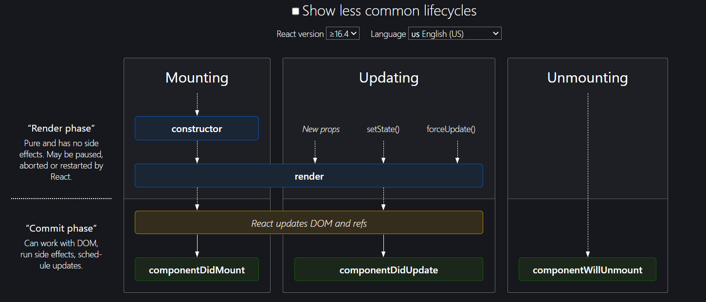

### Topics that are covered:
- Quick Test 
- Children of Children in routing
- Class Based Component
- extends
- props in CBC and FBC
### Quick Test
1. Which tag do we use for routing?
- Link tag

2. From where do we import the Link tag?
- react-router-dom

3. What is Link using behind the scene
- just an anchor tag

4. What hook do we use to read the url?
- useParams()

5. What function did we use to confugure our routing?
- createBrowserRouter()

6. What component that we use to provide the router to app?
- Router Provider

7. Suppose we have children in the routing, where do these children get injected?
- Outlet component

8. What element do we use to show the error in the routing?
- errorElement

### Children of Children
If you want to render children inside children 
steps with example
1. create profile component
```js
const Profile = () => {
    return (
        <div>
            <h2>Profile rendered...</h2>
       </div>
   ) 
}
export default Profile;
```
2. create children of children route
```js
const appRouter = createBrowserRouter([
    {
        path: "/",
        element: <Layout />,
        errorElement: <Error />,
        children: [
            {
                path: "/about",
                element: <About />,
                children: [{
                    path: "profile",
                    element:<Profile/>
                }]
            },
            
        ],
    }
]);
```
3. Pass outlet component for child component
```js 
import { Outlet } from "react-router-dom";

const About = () => {
    return (
        <div className="container">
            <h1>About page is coming soon...</h1>
            <Outlet />
        </div>
    )
}
export default About;
```
- Note :
   - Never use `/profile` for children of children (nested route). slash means concate with root not the relative path. Instead of `/profile`, use `profile`.
   - Outlet is replaced by child component. So, you can directly use child component instead of <Outlet /> there

### Class based component (CBC)
- React initially started with class based component.
- These hooks have recently started coming in. Earlier, there was no concept of functional based component.
- It used to be very pity to write the code in CBC. It used to be very lengthy , messy, confusing for fellow developers, less maintainable.
- class based component is no longer in use.
- Note: If you are creating new project, please don't write CBC. Always prefer FBC.
- Purpose of learning CBC:
   - Many companies can have older projects.
   - You should know the CBC
   - Highly asked in the interviews
   - Know CBC but do not use.
```js
import React from "react";
class Profile extends React.Component{
    render() {
        return(<h1>Profile class renders..</h1>)
    }
}
export default Profile;
```
- Steps:
   - import React from react.
   - Create class that extends from React.Component.
   - use render() that returns piece of JSX.
   - export that class.
- You can import like below also:
`import {Component} from "react";`

### extends
- It comes under the inheritance.
- When we want property and function from parent then we should use extend with the parent class name.

Eg: `class Profile extends React.Component{}`

### props in CBC and FBC

- FBC:
`<Profile name="Rupa"/>`

 ```js
 const Profile = (props) => {
    return (
        <div>
            <h2>Profile rendered...</h2>
            {props.name}
       </div>
   ) 
}
export default Profile;
```
- CBC:
`<Profile name="Rupa"/>`
```js
class Profile extends React.Component{
    render() {
        return (<div>
            <h1>Profile class renders..</h1>
            {this.props.name}
        </div>)
    }
}
export default Profile;
```
   - When React tracks our component, it just takes the props and it will attaches to this keyword of the class instace
   - props is an object and name is its properties.
   - render nomencluture comes from render().
   - render means return piece of jsx.

### state variable in CBC and FBC

- FBC:

 ```js
 import {useState} from 'react';
 const Profile = () => {
   const [count] = useState(0);
    return (
        <div>
            <h2>Count:{count}</h2>
       </div>
   ) 
}
export default Profile;
```
- CBC:

```js

class Profile extends React.Component{
   constructor(props){
      super(props);
      // create state
      this.state{
         count:0;
      }
   }
    render() {
        return (<div>
            <h1>Profile class renders..</h1>
            <h1>Count: {this.state.count}</h1>
            {this.props.name}
        </div>)
    }
}
export default Profile;
```
- Need to write cconstructor with props parameter
- Under the constructor, we should use super(props).
- super() is mandatory
- use this.state, for creating state variables
- we can destructure also. `const {count}=this.state`

### Two states in CBC and FBC
- FBC:
```js
const [count1] = useState(0);
const [count2] = useState(0);
```
- CBC
```js
constructor(props){
      super(props);
      // create state
      this.state{
         count1:0,
         count2:0
      }
   }
```
- Never do like below
```js
constructor(props){
      super(props);
      // create state
      this.state{
         count1:0,
      };
      this.state{
         count2:0
      }
   }
```
- React used one object to maintain states behind the scene. Don't do this.state{//code} multiple times

### setState in CBC and FBC
- FBC:

```js
 const [count,setCount] = useState(0);
 return (<div>
            <button onClick={()=>setCount(1)}>click</button>
        </div>)
    

```
- CBC (this.setState)
```js

 return (<div>
            <button onClick={()=>{
               this.setState({
                  count:1
               })
            }}>click</button>
        </div>)
    

```
- use setState. Do not mutate directly.`this.state.count=1`---> Don't do it.
- Reconcilliation happens with setState, not with directly mutated object.
- Reconcilliation happens in the same way whether it's CBC or FBC.

### Multiple setState
- FBC: I know what is going to be set
```js
 const [count1,setCount1] = useState(0);
 const [count2,setCount2] = useState(0);

 return (<div>
            <button onClick={()=>
            setCount1(1);
            setCount2(1);
            }>click</button>
        </div>)
```
- CBC (this.setState): I don't know what is going to be set
```js

 return (<div>
            <button onClick={()=>{
               this.setState({
                  count1:1
                  count2:1
               })
            }}>click</button>
        </div>)
```

### Why is React so popular?
- Reconcilliation, Bundlers are not the only thing for popularily. React has constantly made developers happy.

### Sequence of excution in CBC for render and contructor
- constructor ----> render()

### Function to call the API in CBC and FBC
- FBC 
   - useEffect
   - Sequence : render ---> useEffect

- CBC
   - componentDidMount
   - sequence : constructor---> render component---> componentDidMount()
   - componentDidMount(){//call the api}

### Execution sequence of render, constructor, componentDidMount() in CBC when there is a parent and a child
- parent constructor---> parent render---> child constructor---> child render---> child componentDidMount()---> parent componentDidMount

### Execution sequence of a parent with 2 children
parent
   child 1
   child 2
- parent constructor---> parent render-->child 1 constructor---> child 1 render--->child 2 constructor---> child 2 render-->child 1 componentDidMount() --> child 2 componentDidMount() -->  parent componentDidMount

### Component Life cycle


### use of componentWillUnmount
- The componentWillUnmount() method allows us to execute the React code when the component gets destroyed or unmounted from the DOM (Document Object Model). 
- This method is called during the Unmounting phase of the React Life-cycle i.e before the component gets unmounted.
- All the cleanups such as invalidating timers, canceling network requests, or cleaning up any subscriptions that were created in componentDidMount() should be coded in the componentWillUnmount() method block.
- Tip: Never call setState() in componentWillUnmount() method.
- Eg: 
```js
componentDidMount(){
  setInterval(()=>{
    console.log("hello")
  },1000);
}
```
- It will call `componentDidMount()` every second.
- cons:
  - If you will leave the page, it will still gets called.
  - This is the problem of SPA.
  - Because it's not reloading of refreshing.
  - Performance loss.
  - Needs to be cleaned with the help of `componentWillUnmount()`
- How to clean :
1. Assign the funtion to the variable.
```js
componentDidMount(){
  this.timer=setInterval(()=>{
    console.log("hello")
  },1000);
}
```
2. use `componentWillUnmount()`.
```js
componentWillUnmount(){
  clearInterval(this.timer);
}
```

### References:

- [React Life Cycle Method Diagram](https://projects.wojtekmaj.pl/react-lifecycle-methods-diagram/)
- [createHashRouter](https://reactrouter.com/en/main/routers/create-hash-router)
- [createMemoryRouter](https://reactrouter.com/en/main/routers/create-memory-router]
- [Code Link](https://bitbucket.org/namastedev/namaste-react-live/src/master/)
- [asyn useEffect](https://ultimatecourses.com/blog/using-async-await-inside-react-use-effect-hook#:~:text=Why%3F,]function%20will%20never%20get%20called.)